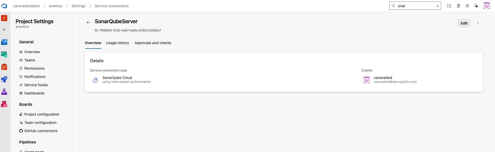
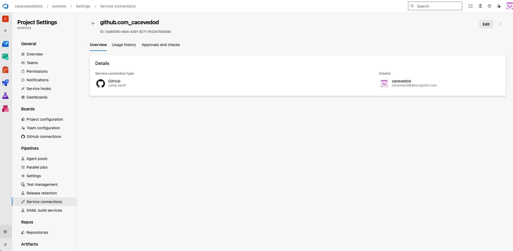
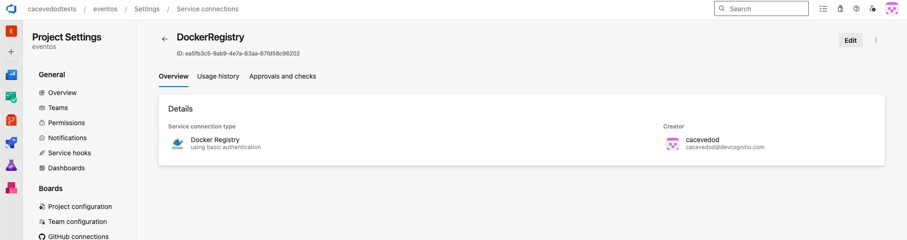
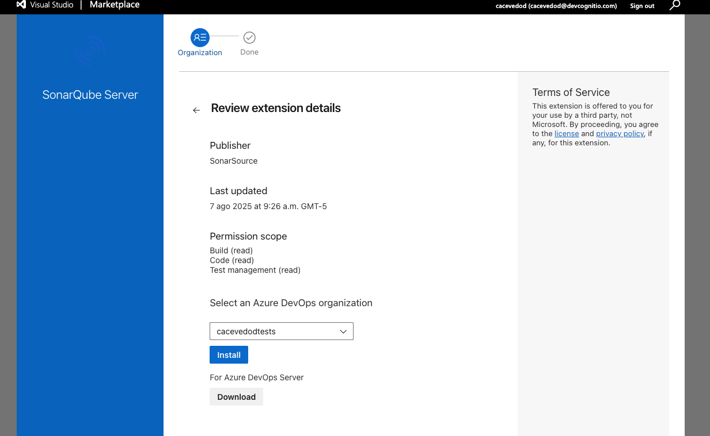

# Ejemplo Java + Spring Boot + Gradle Wrapper para Azure DevOps

Este proyecto es un ejemplo de aplicación Java usando Spring Boot y Gradle Wrapper, preparado para CI/CD en Azure DevOps utilizando un pipeline basado en template centralizado.

## ¿Cómo funciona el pipeline?

El archivo `azure-pipelines.yml` extiende el template `azure-devops/java-ci-template.yml` de este repositorio. Esto permite mantener la lógica de CI/CD reutilizable y actualizable desde un solo lugar.

### Parámetros del template

| Parámetro         | Descripción                                   | Valor por defecto |
|-------------------|-----------------------------------------------|-------------------|
| workingDirectory  | Carpeta raíz del proyecto                     | .                 |
| javaVersion       | Versión de Java a usar                        | 17                |
| runSonar          | Ejecuta análisis SonarQube                    | false             |
| runCheckov        | Ejecuta análisis de seguridad Checkov         | false             |
| runDockerBuild    | Construye la imagen Docker                    | false             |
| runDockerPush     | Publica la imagen Docker                      | false             |

#### Ejemplo de uso en `azure-pipelines.yml`

```yaml
trigger:
  - main

extends:
  template: ../../azure-devops/java-ci-template.yml
  parameters:
    workingDirectory: .
    javaVersion: '17'
    runSonar: true
    runCheckov: true
    runDockerBuild: true
    runDockerPush: false
```

## Requisitos previos para ejecutar el pipeline

1. **Crear los Service Connections necesarios:**
   - **SonarCloud**: Para análisis de calidad de código. Debe llamarse `SonarQubeServer` en el pipeline.
     
   - **GitHub Template**: Para usar plantillas centralizadas desde GitHub.
     
   - **Docker Hub**: Para publicar imágenes Docker en Docker Hub.
     

2. **Instalar la extensión de SonarCloud en Azure DevOps:**
   - Ve al marketplace de Azure DevOps y busca "SonarCloud".
   - Instala la extensión en tu organización/proyecto.
   - 

## Jobs principales del pipeline

- **Build & Unit Tests**: Compila y ejecuta pruebas con Gradle, publica resultados y cobertura.
- **SonarQube Analysis**: (opcional) Ejecuta análisis de calidad si `runSonar` es true.
- **Security & Docker**: (opcional) Ejecuta Checkov y construye/publica imagen Docker según los flags.

## Ejecución local

Compila y prueba localmente con:

```sh
./gradlew build
./gradlew test
```

Construye la imagen Docker:

```sh
docker build -t azure-devops-java:latest .
```

## Notas

- El pipeline centralizado facilita la actualización y mantenimiento de la lógica de CI/CD.
- El Dockerfile sigue buenas prácticas de seguridad (usuario no root, healthcheck).
- El archivo `.gitignore` debe incluir carpetas y archivos generados por Gradle, Java y Docker.

---

¿Dudas o sugerencias? ¡Contribuye o abre un issue!
