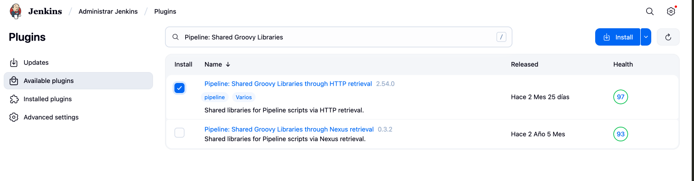
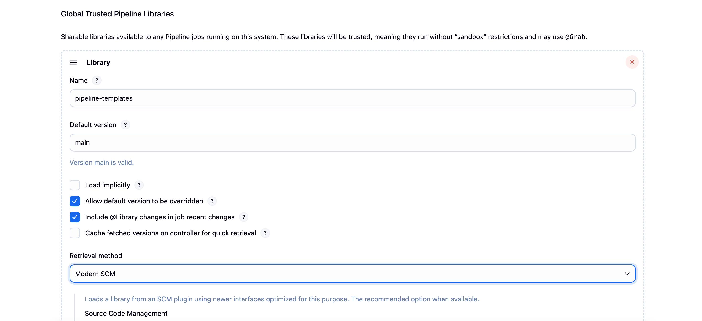
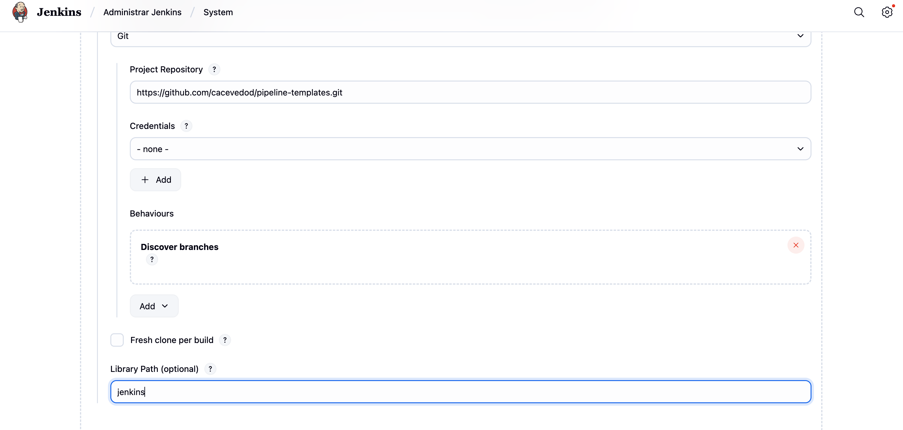
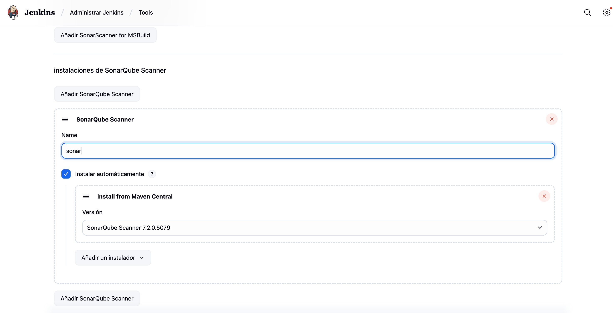
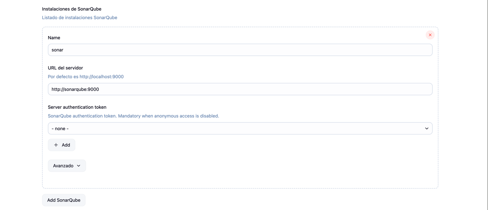
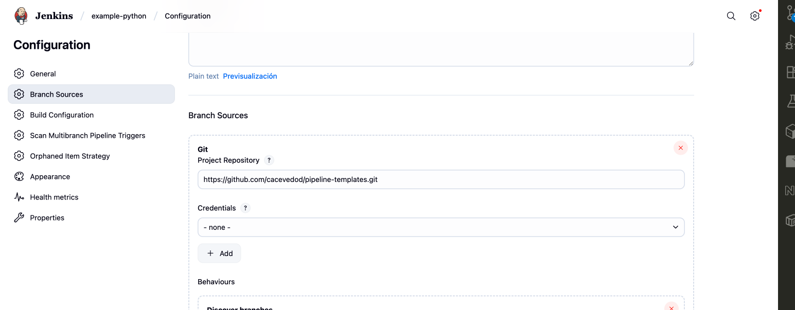
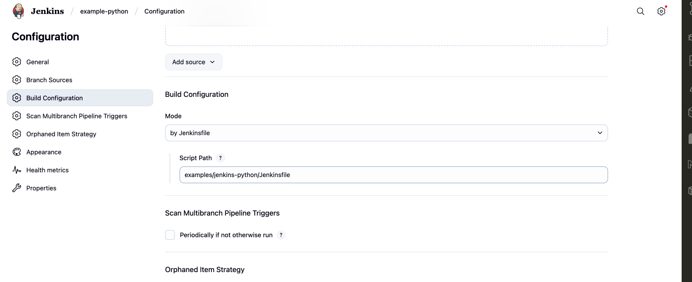

# Ejemplo: Uso de template de Jenkins para Python

Este ejemplo muestra cómo usar el template de CI para Python en Jenkins.

## Estructura

- `Jenkinsfile` (incluye el template)
- Código fuente Python

## Parámetros obligatorios del template

| Parámetro      | Descripción                                              |
|---------------|----------------------------------------------------------|
| pythonVersion | Versión de Python a usar en el pipeline (ej: '3.11')     |
| path          | Ruta al código fuente o raíz del proyecto (ej: 'app')    |

## Prerrequisito: Instalar plugins necesarios

### Para usar agentes Docker en Jenkins

Si quieres que el pipeline corra en un contenedor Python (como en este ejemplo), necesitas:

- Instalar el plugin **Docker Pipeline** desde *Manage Jenkins > Manage Plugins*.
- Que Jenkins tenga acceso al demonio Docker (por ejemplo, usando Docker in Docker o montando el socket `/var/run/docker.sock`).

Sin este plugin, el bloque `agent { docker { ... } }` no funcionará y el pipeline fallará.

A partir de Jenkins LTS recientes, los siguientes plugins no vienen instalados por defecto y son necesarios:

1. Ve a **Manage Jenkins > Manage Plugins**.
2. Busca e instala los plugins:
   - **Pipeline** (permite ejecutar pipelines con Jenkinsfile)
   - **Pipeline: Shared Groovy Libraries**
   - **Git**
   - **Git client**
   - **Docker Pipeline**
   - **SonarQube Scanner** (para integración con SonarQube)

## Configuración de la librería global

1. Ve a **Manage Jenkins > Configure System**.
2. Busca la sección **Global Pipeline Libraries**.
3. Haz clic en **Add** y completa los siguientes campos:
   - **Name**: `pipeline-templates`
   - **Default version**: `main` (o el branch/tag que prefieras)
   - **Retrieval method**: `Modern SCM`

1. En **Source Code Management**, selecciona **Git** (debe estar disponible si instalaste el plugin 'Git client plugin').
2. Completa:
   - **Project Repository**: URL HTTPS o SSH de tu repo (ejemplo: `https://github.com/cacevedod/pipeline-templates.git`)
   - **Library Path**: `jenkins` (para que Jenkins busque los templates en la carpeta correcta)

Guarda los cambios.

## ⚠️ Recuerda configurar el secret `sonar-token` en Jenkins

Para que el pipeline pueda ejecutar análisis con SonarQube, debes crear una credencial tipo **Secret text** en Jenkins con el nombre exacto `sonar-token` y el valor del token de tu usuario en SonarQube.

1. Ve a **Manage Jenkins > Manage Credentials**.
2. Selecciona el dominio adecuado (o global).
3. Haz clic en **Add Credentials**.
4. Tipo: **Secret text**
5. **Secret**: (tu token de SonarQube)
6. **ID**: `sonar-token`
7. Guarda.

Sin esta credencial, el pipeline fallará al intentar ejecutar SonarQube.

---

## Configuración del SonarQube Scanner en Jenkins

1. Ve a **Manage Jenkins > Global Tool Configuration**.
2. Busca la sección **SonarQube Scanner**.
3. Haz clic en **Add SonarQube Scanner** y define un nombre (ejemplo: `SonarQubeScanner`) y la instalación automática.

Guarda los cambios.

## Configuración del servidor SonarQube en Jenkins

1. Ve a **Manage Jenkins > Configure System**.
2. Busca la sección **SonarQube servers**.
3. Haz clic en **Add SonarQube** y completa:
   - **Name**: Nombre identificador (ejemplo: `SonarQubeServer`)
   - **Server URL**: Usa `http://sonarqube:9000` si ejecutas SonarQube con Docker Compose (el nombre del servicio es `sonarqube`)
   - **Server authentication token**: Si el acceso anónimo no está habilitado, genera un token en SonarQube y agrégalo aquí como credencial secreta.

Guarda los cambios.

## Configuración de un pipeline Multibranch usando el template

1. Ve a **New Item** en Jenkins y selecciona **Multibranch Pipeline**.
2. Asigna un nombre al pipeline y haz clic en OK.
3. En la configuración, en la sección **Branch Sources**, selecciona **Git** e ingresa la URL del repositorio de tu ejemplo.
4. Guarda la configuración.

Ejemplo de configuración:

## Uso

1. Copia el template desde `../../templates/jenkins/python/Jenkinsfile` a la raíz de tu proyecto como `Jenkinsfile`.
2. Ajusta los valores de los credentials y variables según tu entorno Jenkins.
3. Ejecuta el pipeline en tu instancia Jenkins y verifica los resultados.
